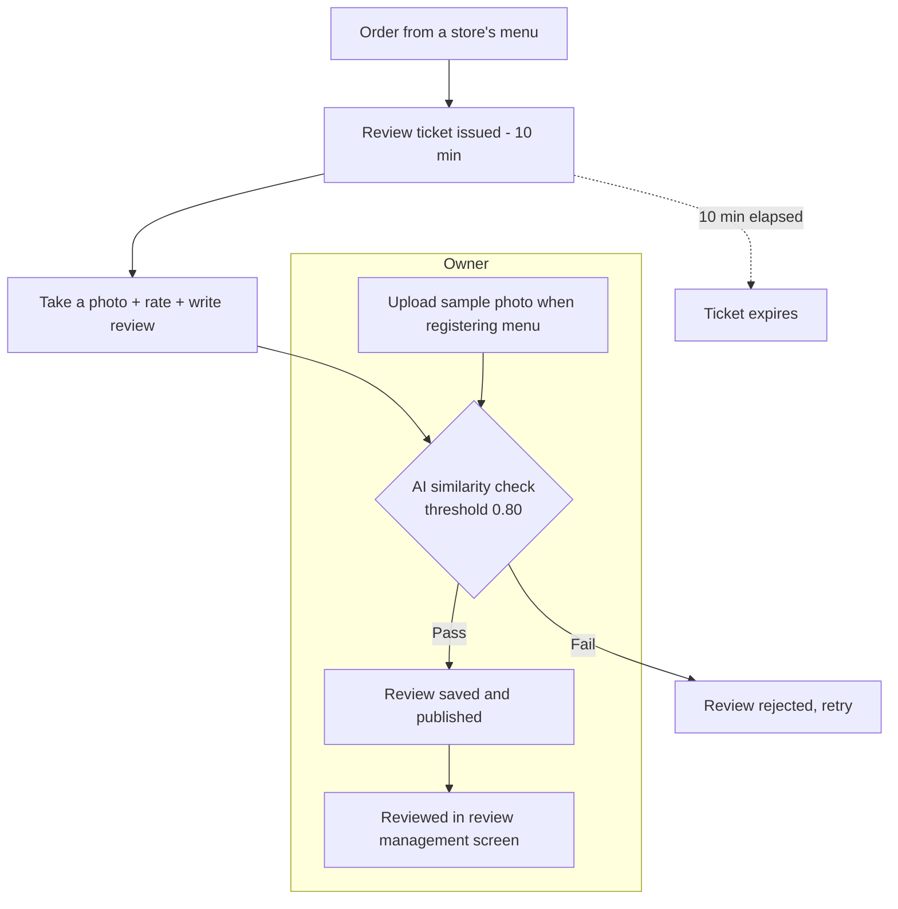
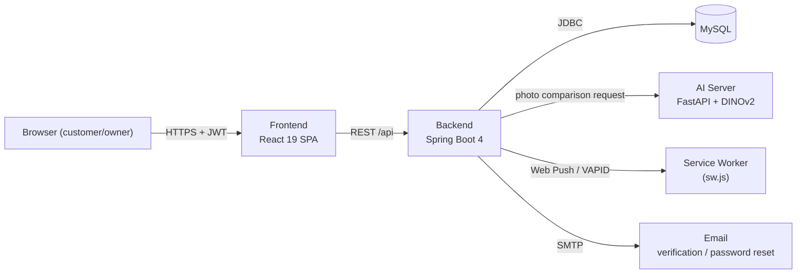

# 🎫 ReviewTicket

**"A review platform that verifies your photo actually matches what you ordered."**

[🇰🇷 한국어](./README.md) · [🇺🇸 English](./README.en.md)

---

## 📌 Background

A star rating and a photo aren't enough to prove a review is actually about the meal someone ordered — a photo from another restaurant or a different dish slips through unnoticed.

**ReviewTicket** solves this by only letting customers write a review inside a **review ticket** issued right after an order, and by running the attached photo through an **AI image-similarity model** against the restaurant owner's registered menu photos — only photos that pass are saved as reviews.

> [!NOTE]
> A review ticket is valid for **24 hours** after an order is placed. Within that window, the customer must attach a photo, pick a rating, and write 10–50 characters of review text — and the photo must pass AI verification (similarity threshold **0.80**) to actually be saved.

---

## 💡 Core Value

| Problem                                          | How ReviewTicket solves it                                                                                         |
| ------------------------------------------------ | ------------------------------------------------------------------------------------------------------------------ |
| Fake reviews for items never ordered             | Writing a review requires a **review ticket** tied to a real order                                                 |
| Any photo can be attached without being checked  | Photos are automatically compared against the owner's menu sample photos via **DINOv2 image embedding similarity** |
| Customers miss the window to leave a review      | **Web push notifications** remind them even when the app is closed                                                 |
| Owners can't see review/order status at a glance | A dedicated dashboard separates pending orders from completed reviews                                              |

  

## ✨ Key Features

### Customer

- 🏠 Browse stores and order menu items
- ⏱️ Write a review using a **10-minute review ticket** issued right after ordering
- 📸 Attach a photo — AI automatically compares it against menu photos, and only passing reviews are saved
- 📜 View order history and all reviews you've written
- 🔔 Subscribe to web push notifications (daily reminder)
- 🔐 Email-verified sign-up, password reset

### Owner

- 🏪 Manage store information
- 🍽️ Register/edit menu items with **sample photos** used as the verification baseline
- ✅ Check orders awaiting review and completed reviews

  

## 🧭 User Flow

  

## 🖥️ Screens & Features

<strong>Customer screens</strong>

| Screen                       | Path                                        | Description                                                   |
| ----------------------------- | ------------------------------------------- | --------------------------------------------------------------- |
| Onboarding / Login / Sign up | `/onboarding`, `/login/customer`, `/signup` | Role-separated login (customer/owner), email-verified sign-up |
| Home                         | `/home`                                     | Store list, web push subscription prompt                        |
| Order                        | `/order/:storeId`                           | Select menu items and place an order                            |
| Store reviews                | `/order/:storeId/reviews`                   | Browse reviews left for a store                                 |
| Order history                | `/order-history`                            | List of my orders and review-ticket status                      |
| My reviews                   | `/reviews`                                  | All reviews I've written                                        |

<strong>Owner screens</strong>

| Screen            | Path       | Description                                |
| ------------------ | ---------- | --------------------------------- |
| Store management  | `/stores`  | Register/edit store information               |
| Menu management   | `/menu`    | Register menu items and their verification sample photos     |
| Review management | `/reviews` | Orders pending review / completed reviews |

  

## 🏗️ Architecture

- **Frontend ↔ Backend**: authenticated via a JWT in the `Authorization` header (no sessions or cookies)
- **Backend ↔ AI Server**: one review photo is compared in parallel against up to 5 menu sample photos; the highest similarity score decides pass/fail
- **Backend → Browser**: sends notifications via VAPID-based Web Push, and automatically cleans up subscriptions from the DB when a push fails with 404/410
- **DB schema**: JPA only reads/writes data — the schema itself is managed directly through SQL files under `backend/DB/`

  

## 🛠️ Tech Stack

| Area              | Stack                                                                                |
| ----------------- | ------------------------------------------------------------------------------------ |
| **Frontend**      | React 19, TypeScript, Vite 8, React Router 7, Tailwind CSS 4, lucide-react           |
| **Backend**       | Java 21, Spring Boot 4.1 (Web MVC, Data JPA, Security, Validation, Mail), JJWT (JWT) |
| **AI Server**     | Python, FastAPI, DINOv2 (`facebook/dinov2-base`, Meta AI)                            |
| **Database**      | MySQL                                                                                |
| **Notifications** | Web Push (VAPID) via `nl.martijndwars:web-push`, Bouncy Castle                       |
| **Auth**          | Email/password + JWT, email verification via SMTP                                    |
