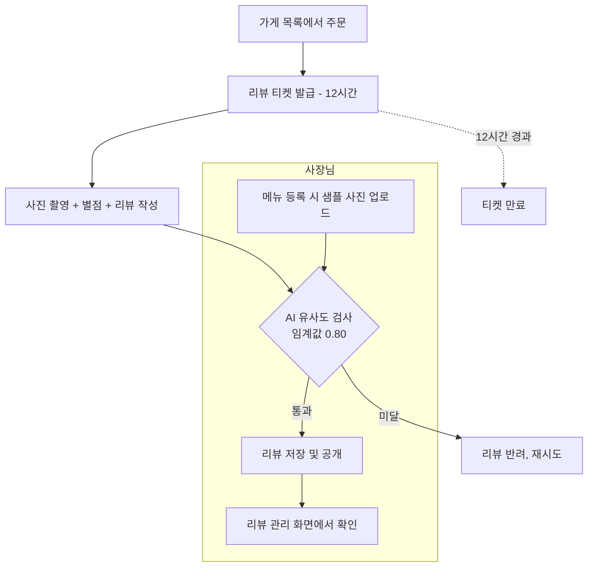
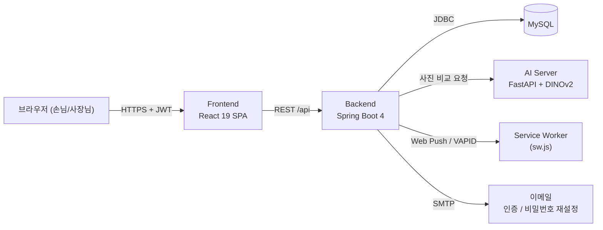

# 🎫 ReviewTicket

**"진짜 주문한 메뉴가 맞는지, 사진으로 검증하는 리뷰 플랫폼"**

[🇰🇷 한국어](./README.md) · [🇺🇸 English](./README.en.md)

---

## 📌 기획배경

배달·포장 주문 후 남기는 리뷰는 별점과 사진만으로는 "정말 그 메뉴를 먹고 쓴 리뷰인지" 확인할 방법이 없습니다. 다른 가게, 다른 메뉴 사진을 가져다 붙여도 걸러지지 않는다는 뜻입니다.

**ReviewTicket**은 손님이 주문한 뒤 발급받는 **리뷰 티켓** 안에서만 리뷰를 쓸 수 있게 하고, 첨부한 사진을 **AI 이미지 유사도 모델**로 사장님이 등록한 메뉴 사진과 대조해, 통과한 사진만 리뷰로 저장하는 주문 기반 리뷰 서비스입니다.

> [!NOTE]
> 리뷰 티켓은 주문 직후부터 **24시간** 동안만 유효합니다. 이 시간 안에 사진·별점·리뷰 내용(10~50자)을 작성해야 하며, 사진이 AI 검증(유사도 임계값 **0.80**)을 통과해야 실제로 저장됩니다.

---

## 💡 핵심 가치

| 문제                                     | ReviewTicket의 해결 방식                                                            |
| ---------------------------------------- | ----------------------------------------------------------------------------------- |
| 주문하지 않은 메뉴로 허위 리뷰를 남긴다  | 주문 건에 묶인 **리뷰 티켓**이 있어야만 리뷰 작성 화면에 진입 가능                  |
| 아무 사진이나 첨부해도 걸러지지 않는다   | 사장님이 등록한 메뉴 샘플 사진과 **DINOv2 이미지 임베딩 유사도**를 비교해 자동 검증 |
| 손님이 리뷰 쓸 타이밍을 놓친다           | 앱을 닫아도 브라우저 **웹 푸시 알림**으로 리마인드                                  |
| 사장님이 리뷰/주문 현황을 한눈에 못 본다 | 대기 중인 주문과 완료된 리뷰를 구분한 전용 관리 화면 제공                           |

  

## ✨ 주요 기능

### 손님 (Customer)

- 🏠 가게 목록 조회 및 메뉴 주문
- ⏱️ 주문 직후 발급되는 **12시간짜리 리뷰 티켓**으로 리뷰 작성
- 📸 리뷰 작성 시 사진 첨부 → AI가 메뉴 사진과 자동 대조 후 통과된 리뷰만 저장
- 📜 내 주문 내역 / 내가 쓴 리뷰 모아보기
- 🔔 웹 푸시 알림 구독 (매일 낮 알림 수신)
- 🔐 이메일 인증 기반 회원가입, 비밀번호 재설정

### 사장님 (Owner)

- 🏪 가게 정보 관리
- 🍽️ 메뉴 등록/수정 (검증 기준이 되는 **샘플 사진** 등록)
- ✅ 리뷰 대기 중인 주문 / 완료된 리뷰 목록 확인

  

## 🧭 사용자 Flow

  

## 🖥️ 주요 화면 및 기능 설명

<strong>손님 화면</strong>

| 화면                       | 경로                                        | 설명                                                     |
| -------------------------- | ------------------------------------------- | -------------------------------------------------------- |
| 온보딩 / 로그인 / 회원가입 | `/onboarding`, `/login/customer`, `/signup` | 역할(손님/사장님)을 나누어 로그인, 이메일 인증 기반 가입 |
| 홈                         | `/home`                                     | 가게 목록, 웹 푸시 알림 구독 유도                        |
| 주문                       | `/order/:storeId`                           | 메뉴 선택 및 주문                                        |
| 가게 리뷰                  | `/order/:storeId/reviews`                   | 해당 가게에 달린 리뷰 열람                               |
| 주문 내역                  | `/order-history`                            | 내 주문 목록, 리뷰 티켓 상태 확인                        |
| 내 리뷰                    | `/reviews`                                  | 내가 작성한 리뷰 모아보기                                |

<strong>사장님 화면</strong>

| 화면      | 경로       | 설명                              |
| --------- | ---------- | --------------------------------- |
| 가게 관리 | `/stores`  | 가게 정보 등록/수정               |
| 메뉴 관리 | `/menu`    | 메뉴 및 검증용 샘플 사진 등록     |
| 리뷰 관리 | `/reviews` | 리뷰 대기 주문 / 완료된 리뷰 확인 |

  

## 🏗️ Architecture

- **Frontend ↔ Backend**: JWT를 `Authorization` 헤더에 담아 인증 (세션·쿠키 미사용)
- **Backend ↔ AI Server**: 리뷰 사진 1장과 메뉴 샘플 사진(최대 5장)을 병렬로 비교, 최고 유사도 값으로 통과 여부 판정
- **Backend → 브라우저**: VAPID 기반 Web Push로 알림 발송, 구독이 만료(404/410)되면 자동으로 DB에서 정리
- **DB 스키마**: JPA는 조회/저장만 담당하고, 스키마는 `backend/DB/`의 SQL 파일로 직접 관리

  

## 🛠️ Tech Stack

| 영역          | 스택                                                                                 |
| ------------- | ------------------------------------------------------------------------------------ |
| **Frontend**  | React 19, TypeScript, Vite 8, React Router 7, Tailwind CSS 4, lucide-react           |
| **Backend**   | Java 21, Spring Boot 4.1 (Web MVC, Data JPA, Security, Validation, Mail), JJWT (JWT) |
| **AI Server** | Python, FastAPI, DINOv2 (`facebook/dinov2-base`, Meta AI)                            |
| **Database**  | MySQL                                                                                |
| **알림**      | Web Push (VAPID) + `nl.martijndwars:web-push`, Bouncy Castle                         |
| **인증**      | 이메일/비밀번호 + JWT, 이메일 인증(SMTP)                                             |
